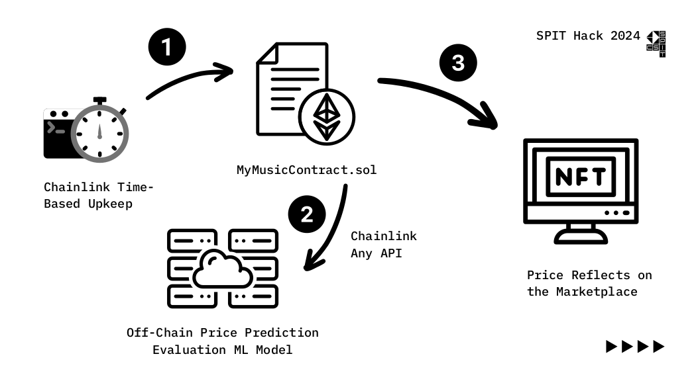

<h1 align="center">
  
   
  Artisan Vault 
</h1>

   <strong>Artisan Vault</strong> - Empowering Creativity with Secure NFTs

**SPIT HACK - 2024 || Aenate**    
<!--   Add any <a href="https://shields.io/">Shields</a> here -->
<!--  -->

---

## 📝Description

- **Copyright Protection** : Copyright Infringement and Lack of Transparency while tackling piracy is a major issue in traditional systems

- **IPR & Royalty** : The art forms are an intellectual property of the artists. In traditional systems, the intermediaries (like TSeries for musicians) exploit the intellectual property for profitability, barring the artist of the deserved royalty.
- **Tokenization of Art** :  Art forms should be represented as non-fungible tokens (NFTs) on the blockchain as a digital asset

### Solution

NFT Categories : 
- **Art**: Minting, transfer of ownership through selling,bidding
- **Music**: Dynamic NFT implementation for dynamic price prediction based on song popularity, Random Rewards using VRF, Stream per use and Subscription Model
- **Literature**:Special Bonuses for Loyal Fans (Bonus Chapters, Audiobooks, etc.), Retailer/Publisher Commission Eliminated, Special NFT Copy with Digital Signature.
- **Software**: Royalty and Open Source Software Inheritance

---
## Key Features 
- **Pay Per Use** : For less number of streams (like 1 or 2 plays of a song, or one time reading for a book) - a pay per use model can also be availed.
- **Subscription Facility** :  Like Spotify/Kindle Subscription Plans Subscription allows a fixed number of play/stream hours for a user Fans of an author (like Chetan Bhagat) can subscribe for a lifelong subscription of the authors books.
- **Price Evaluation ML Model** : Determining NFT prices is vague. We've 3 diffferent models to help us 
    - Image based Model
    - Regression Model
    - Adaptive Percentile Predictor 

## 🤖Tech-Stack

#### Front-end

- 
 

#### Back-end

- 
- 
- 
- 
- 

---

## 🔮Future Scope
- Fractional NFTs for songs within music albums, or lessons within a book
- Implement the subscription model with NFT Datagroups (like GitCoin Passport Holders)
- Integrate Push Group Chat to the Software NFT Category

---

## :star: Team - Senate

- [Harsh Nag](https://github.com/Jigsaw-23122002) 
- [Sarvagnya Purohit](https://github.com/saRvaGnyA)
- [Siddhant Baheti](https://github.com/0610sid)
- [Labib Asari](https://github.com/labeeb-7z) 

